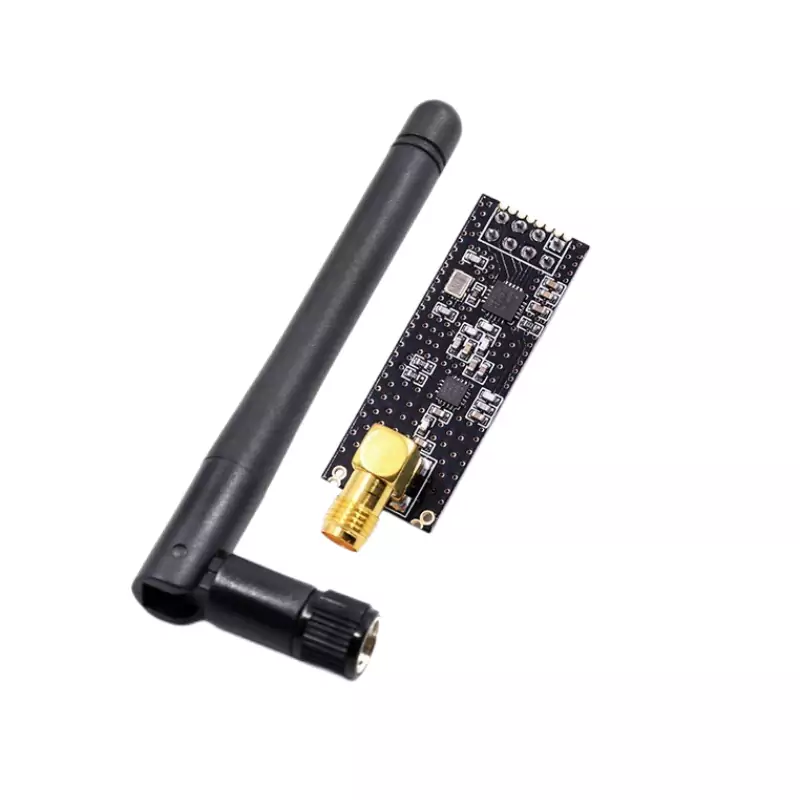
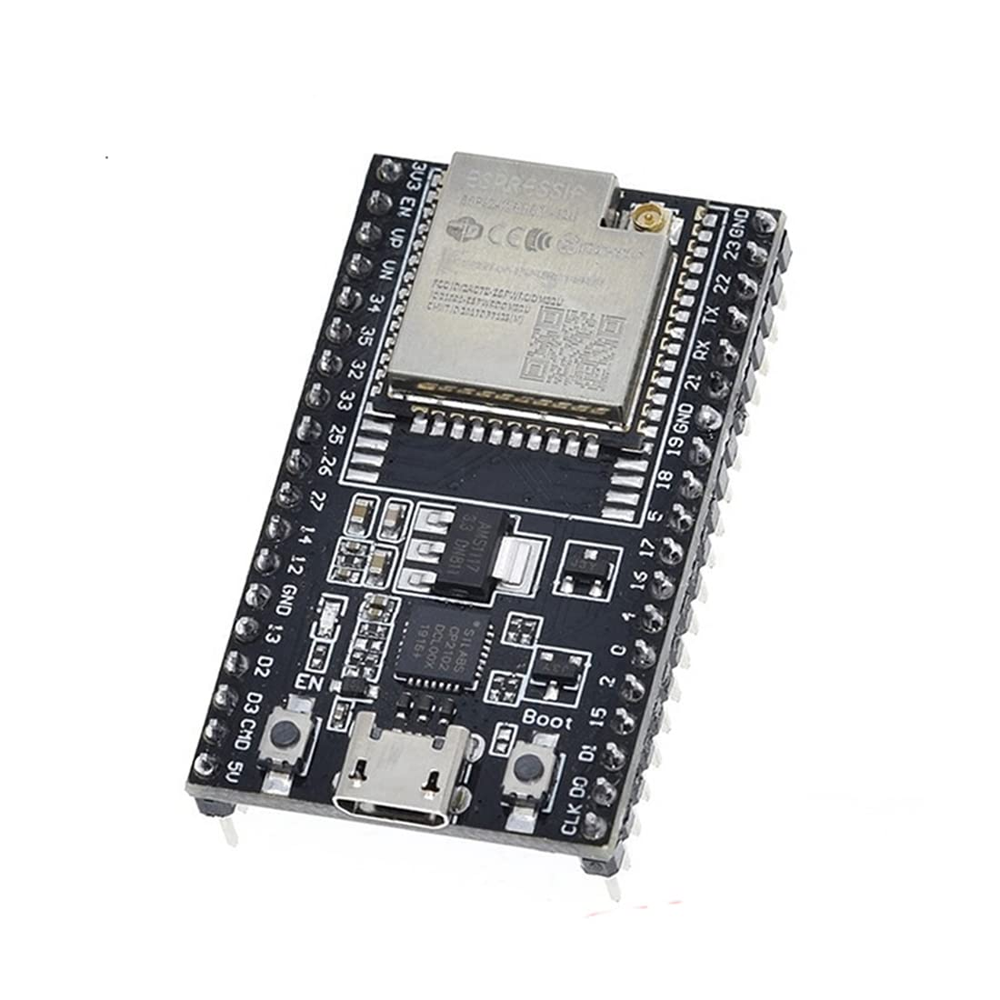
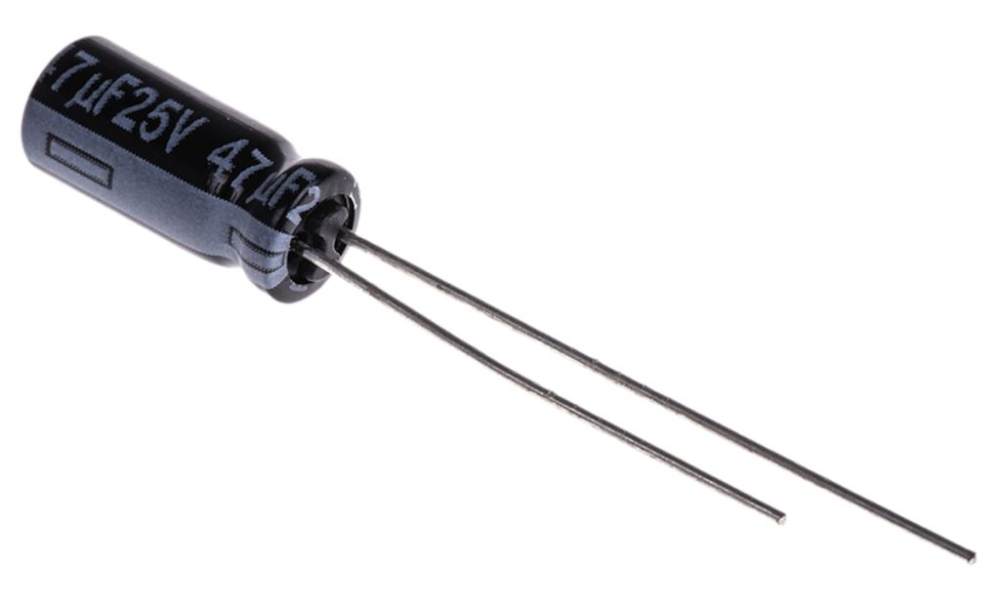
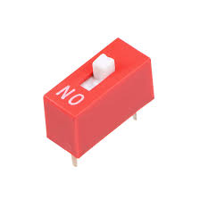
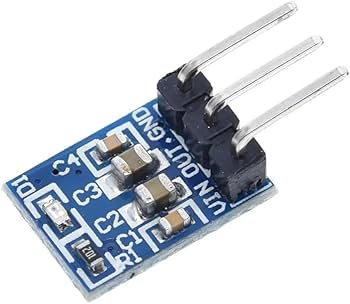
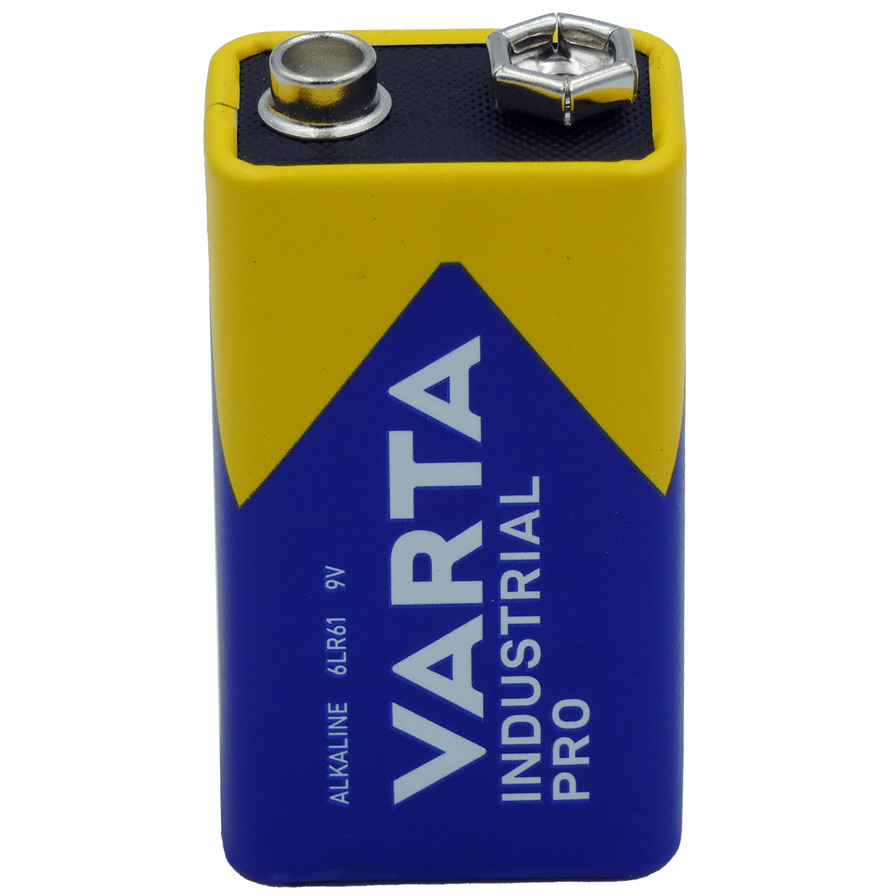
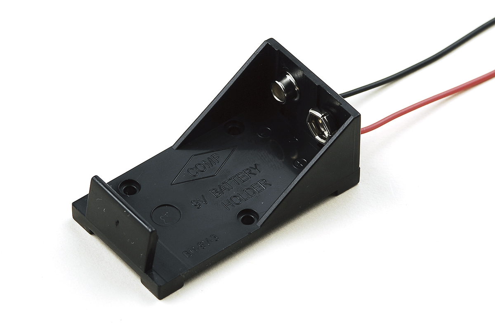
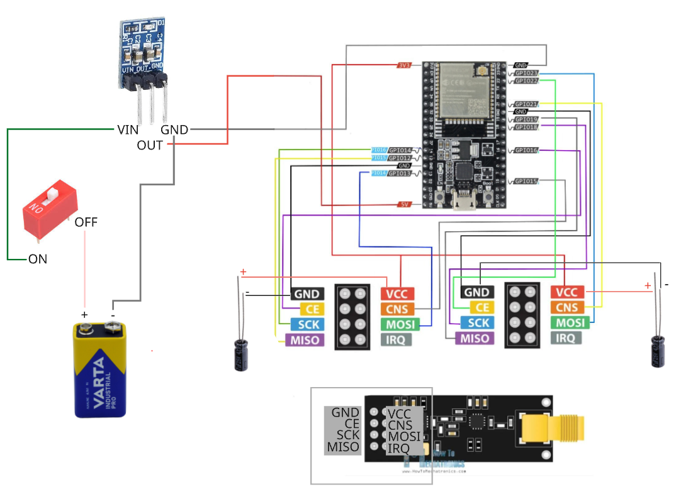

### Open-source Wireless Jamming Pentesting Device using ESP32-WROOM-32U & 2 NRFL01+PA+LNA Modules

 ---
# WHAT DOES IT DO?

**IT CREATES NOISE SIGNAL TO JAM BLUETOOTH AND WIFI USING NRF24L01 AND ESP32 IN RANGE 2.4GHZ DEVICES, EFFECTS MAY VARY DEPENDS ON DEVICE BLUETOOTH VERSIONS....WARNING!!! JAMMING IS ILLEGAL**

---

## REQUIRED DEVICE AND MODULE:
1. `NRF24L01+ PLUS – PA LNA SMA Antenne`
-  

2. `1pc ESP32U` 
- 

3. `25V 47UF CAPACITORF` 
- 

4. `1 DIP SWITCH` 
- 

5. `DC Voltage Regulator Step Down Converter 4.5 V-12 V to 3.3 V/5 V 800 mA Power Supply Regulator Adjustment (5 Volt)` 
- 

6. `9V Alkaline Batteries` 
- 

7. `9V Battery Holder` 
- 

---
 ## PINS TO ATTACH NRF24L01 TO ESP32

### FOR DUAL/TWO NRF24L01 
+ ` HSPI= SCK = 14, MISO = 12, MOSI = 13, CS = 15 , CE = 16`
+ ` VSPI= SCK = 18, MISO =19, MOSI = 23 ,CS =21 ,CE = 22`

### FOR SINGLE/ONE NRF24L01 YOU CAN CHOOSE BETWEEN HSPI OR VSPI 
 - `VSPI= SCK = 18, MISO =19, MOSI = 23 ,CS =21 ,CE = 22`
- `HSPI= SCK = 14, MISO = 12, MOSI = 13, CS = 15 , CE = 16` 

---

### Wiring

---

## UPLOADING CODE TO ESP32
Connect ESP to your laptop
 
 1. `Download and install library "RF24 Master" in Arduino/ IDE`
 [Download RF24 Master](arduino/RF24-master(1).zip)

  2. `Download and install library "Button Master" in Arduino/ IDE`
 [Download Button Master](arduino/button-master(1).zip)

  3. Install ESP32 Board: Tools -> Board -> BoardManager  
  Search for: ESP -> select: "esp32 by Espressif Sytems" & click "Install"

  3. `Download the dual pin code and upload it in Arduino/ IDE`
 [Download Code](arduino/FORDUALPINS.ino)

## OR USE A WEBFLASHER: NO NEED TO DOWNLOAD INO FILE (USE CHROME OR MICROSOFT BROWSER) [WEBFLASHER](https://obstundgemuese26.github.io/BlueNoise26/) SELECT WHAT TO UPLOAD VSPI,HSPI OR DUAL AND CHOOSE RIGHT COM PORT
---

# SPECIAL THANKS
  * [ATOMNFT](https://github.com/dkyazzentwatwa/cypher-jammer?tab=readme-ov-file) - Cypher Jammer

  ---

# TROUBLESHOOTING

### python -m esptool --port COM3 --baud 115200 erase_flash

   ---

###  Phase 1: The Clean Slate (Complete Erase)

We will use a very slow speed (115200) to ensure stability.
Open CMD and type (don't hit enter yet):
python -m esptool --port COM3 --baud 115200 erase_flash
Hold the BOOT button on the ESP32.
Tap the EN/RST button once.
Hit Enter on your keyboard.
Release BOOT only after you see "Erasing..."

###  Phase 2: The Manual "Hard-Wire" (If Phase 1 fails)

If the buttons aren't triggering the bootloader, we bypass them with a jumper wire.
Connect a wire from GPIO 0 to GND.
Unplug and replug the USB.
Run the command:
python -m esptool --port COM3 --baud 115200 erase_flash

If it succeeds, remove the wire before trying to upload code again.
